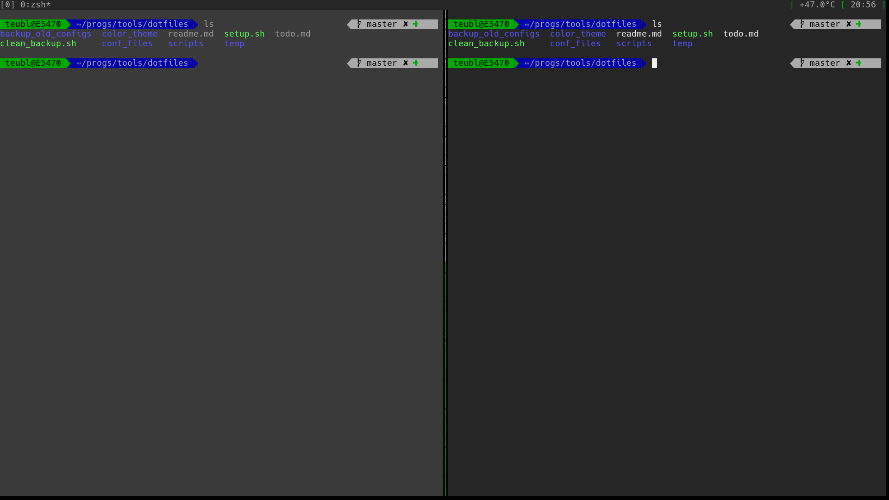
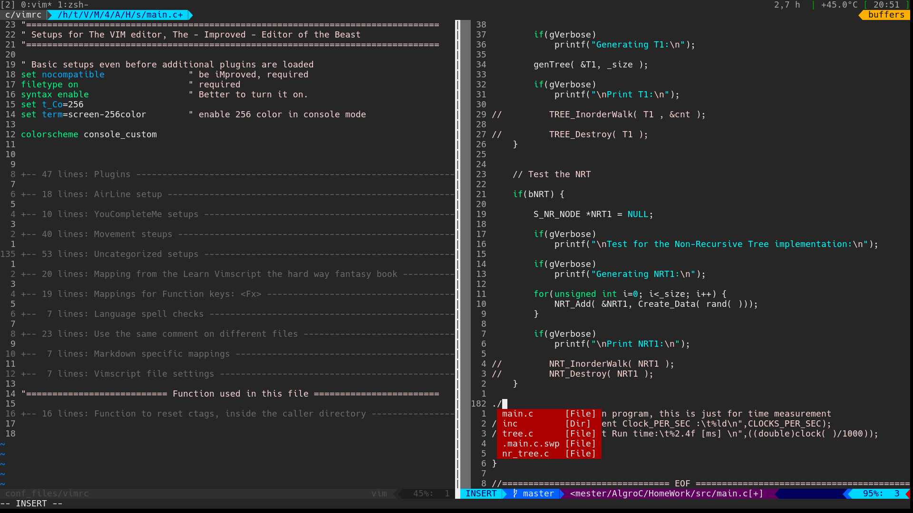

dotFiles
========

A collection of config files and scripts used on my system:
+ Hardware: Dell Latitude E5470
+ OS: Ubuntu 16.04

My aim with these repo - along side to keep safe backup of my files, to create a workspace which run smoothly in pure Linux console - no mouse, no X.

Screenshots
===========

console
-------

Vim
---

